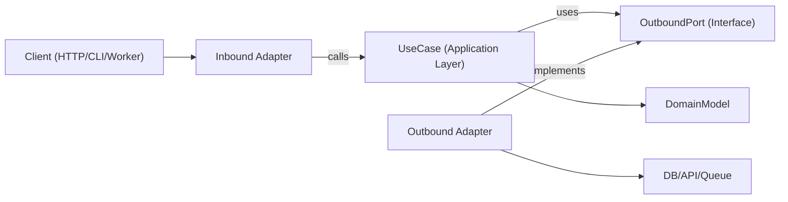

# 헥사고날 아키텍처

헥사고날 아키텍처(Ports and Adapters)는 비즈니스 로직을 프레임워크·전송 계층·영속화 세부사항으로부터 독립적으로 유지한다. 코어 애플리케이션은 추상 포트에 의존하고, 어댑터가 가장자리에서 그 포트를 구현한다.

## 사용 시점

- 장기 유지보수성과 테스트 가능성이 중요한 새 기능 개발.
- 도메인 로직이 I/O 관심사와 섞여 있는 레이어드·프레임워크 중심 코드의 리팩터링.
- 동일한 유스케이스를 여러 인터페이스(HTTP, CLI, 큐 워커, 크론 잡)에서 지원해야 할 때.
- 인프라(데이터베이스, 외부 API, 메시지 버스)를 비즈니스 규칙 재작성 없이 교체하고자 할 때.

요청이 경계, 도메인 중심 설계, 강하게 결합된 서비스의 리팩터링, 또는 애플리케이션 로직과 특정 라이브러리의 분리와 관련될 때 이 스킬을 사용한다.

## 핵심 개념

- **도메인 모델**: 비즈니스 규칙과 엔티티/값 객체. 프레임워크 import 금지.
- **유스케이스(애플리케이션 계층)**: 도메인 행위와 워크플로 단계를 오케스트레이션한다.
- **인바운드 포트**: 애플리케이션이 수행할 수 있는 동작을 기술하는 계약(커맨드/쿼리/유스케이스 인터페이스).
- **아웃바운드 포트**: 애플리케이션이 필요로 하는 의존성에 대한 계약(리포지토리, 게이트웨이, 이벤트 퍼블리셔, 시계, UUID 등).
- **어댑터**: 포트의 인프라·전달 구현체(HTTP 컨트롤러, DB 리포지토리, 큐 컨슈머, SDK 래퍼).
- **컴포지션 루트**: 구체 어댑터를 유스케이스에 바인딩하는 단일 와이어링 위치.

아웃바운드 포트 인터페이스는 보통 애플리케이션 계층에 위치한다(추상화가 진정 도메인 수준일 때만 도메인에 둔다). 인프라 어댑터가 이를 구현한다.

의존성 방향은 항상 안쪽이다:

- 어댑터 -> 애플리케이션/도메인
- 애플리케이션 -> 포트 인터페이스(인바운드/아웃바운드 계약)
- 도메인 -> 도메인 전용 추상화(프레임워크·인프라 의존성 없음)
- 도메인 -> 외부에 의존하지 않음

## 동작 방식

### 1단계: 유스케이스 경계 모델링

명확한 입력·출력 DTO를 가진 단일 유스케이스를 정의한다. 전송 계층 세부사항(Express `req`, GraphQL `context`, 잡 페이로드 래퍼)은 이 경계 바깥에 둔다.

### 2단계: 아웃바운드 포트를 먼저 정의

모든 부수 효과를 포트로 식별한다:

- 영속화 (`UserRepositoryPort`)
- 외부 호출 (`BillingGatewayPort`)
- 횡단 관심사 (`LoggerPort`, `ClockPort`)

포트는 기술이 아니라 능력(capability)을 모델링해야 한다.

### 3단계: 순수 오케스트레이션으로 유스케이스 구현

유스케이스 클래스/함수는 생성자/인자로 포트를 주입받는다. 애플리케이션 수준 불변식을 검증하고, 도메인 규칙을 조율하며, 평범한 데이터 구조를 반환한다.

### 4단계: 가장자리에 어댑터 구축

- 인바운드 어댑터는 프로토콜 입력을 유스케이스 입력으로 변환한다.
- 아웃바운드 어댑터는 앱 계약을 구체 API/ORM/쿼리 빌더로 매핑한다.
- 매핑은 어댑터에 머문다. 유스케이스 안으로 들어오지 않는다.

### 5단계: 컴포지션 루트에서 모든 것을 와이어링

어댑터를 인스턴스화한 뒤 유스케이스에 주입한다. 숨은 서비스 로케이터 동작을 피하기 위해 와이어링은 한 곳에 모은다.

### 6단계: 경계 단위 테스트

- 유스케이스는 가짜 포트로 단위 테스트한다.
- 어댑터는 실제 인프라 의존성으로 통합 테스트한다.
- 사용자 대면 흐름은 인바운드 어댑터를 통해 E2E 테스트한다.

## 아키텍처 다이어그램



## 권장 모듈 레이아웃

명시적 경계를 가진 기능 우선(feature-first) 구조를 사용한다:

```text
src/
  features/
    orders/
      domain/
        Order.ts
        OrderPolicy.ts
      application/
        ports/
          inbound/
            CreateOrder.ts
          outbound/
            OrderRepositoryPort.ts
            PaymentGatewayPort.ts
        use-cases/
          CreateOrderUseCase.ts
      adapters/
        inbound/
          http/
            createOrderRoute.ts
        outbound/
          postgres/
            PostgresOrderRepository.ts
          stripe/
            StripePaymentGateway.ts
      composition/
        ordersContainer.ts
```

## TypeScript 예제

### 포트 정의

```typescript
export interface OrderRepositoryPort {
  save(order: Order): Promise<void>;
  findById(orderId: string): Promise<Order | null>;
}

export interface PaymentGatewayPort {
  authorize(input: { orderId: string; amountCents: number }): Promise<{ authorizationId: string }>;
}
```

### 유스케이스

```typescript
type CreateOrderInput = {
  orderId: string;
  amountCents: number;
};

type CreateOrderOutput = {
  orderId: string;
  authorizationId: string;
};

export class CreateOrderUseCase {
  constructor(
    private readonly orderRepository: OrderRepositoryPort,
    private readonly paymentGateway: PaymentGatewayPort
  ) {}

  async execute(input: CreateOrderInput): Promise<CreateOrderOutput> {
    const order = Order.create({ id: input.orderId, amountCents: input.amountCents });

    const auth = await this.paymentGateway.authorize({
      orderId: order.id,
      amountCents: order.amountCents,
    });

    // markAuthorized는 새 Order 인스턴스를 반환하며, 제자리 변경을 하지 않는다.
    const authorizedOrder = order.markAuthorized(auth.authorizationId);
    await this.orderRepository.save(authorizedOrder);

    return {
      orderId: order.id,
      authorizationId: auth.authorizationId,
    };
  }
}
```

### 아웃바운드 어댑터

```typescript
export class PostgresOrderRepository implements OrderRepositoryPort {
  constructor(private readonly db: SqlClient) {}

  async save(order: Order): Promise<void> {
    await this.db.query(
      "insert into orders (id, amount_cents, status, authorization_id) values ($1, $2, $3, $4)",
      [order.id, order.amountCents, order.status, order.authorizationId]
    );
  }

  async findById(orderId: string): Promise<Order | null> {
    const row = await this.db.oneOrNone("select * from orders where id = $1", [orderId]);
    return row ? Order.rehydrate(row) : null;
  }
}
```

### 컴포지션 루트

```typescript
export const buildCreateOrderUseCase = (deps: { db: SqlClient; stripe: StripeClient }) => {
  const orderRepository = new PostgresOrderRepository(deps.db);
  const paymentGateway = new StripePaymentGateway(deps.stripe);

  return new CreateOrderUseCase(orderRepository, paymentGateway);
};
```

## 다중 언어 매핑

생태계 전반에 동일한 경계 규칙을 적용한다. 문법과 와이어링 스타일만 달라진다.

- **TypeScript/JavaScript**
  - 포트: `application/ports/*` 인터페이스/타입.
  - 유스케이스: 생성자/인자 주입을 사용하는 클래스/함수.
  - 어댑터: `adapters/inbound/*`, `adapters/outbound/*`.
  - 컴포지션: 명시적 팩터리/컨테이너 모듈(숨은 전역 금지).
- **Java**
  - 패키지: `domain`, `application.port.in`, `application.port.out`, `application.usecase`, `adapter.in`, `adapter.out`.
  - 포트: `application.port.*`의 인터페이스.
  - 유스케이스: 일반 클래스(Spring `@Service`는 선택, 필수 아님).
  - 컴포지션: Spring 설정 또는 수동 와이어링 클래스. 와이어링은 도메인/유스케이스 클래스 밖에 둔다.
- **Kotlin**
  - 모듈/패키지는 Java 분할(`domain`, `application.port`, `application.usecase`, `adapter`)을 따른다.
  - 포트: Kotlin 인터페이스.
  - 유스케이스: 생성자 주입(Koin/Dagger/Spring/수동) 사용 클래스.
  - 컴포지션: 모듈 정의 또는 전용 컴포지션 함수. 서비스 로케이터 패턴 회피.
- **Go**
  - 패키지: `internal/<feature>/domain`, `application`, `ports`, `adapters/inbound`, `adapters/outbound`.
  - 포트: 소비하는 애플리케이션 패키지가 소유하는 작은 인터페이스.
  - 유스케이스: 인터페이스 필드를 가진 구조체와 명시적 `New...` 생성자.
  - 컴포지션: `cmd/<app>/main.go`(또는 전용 와이어링 패키지)에서 와이어링하며, 생성자는 명시적으로 유지.

## 피해야 할 안티 패턴

- 도메인 엔티티가 ORM 모델, 웹 프레임워크 타입, SDK 클라이언트를 import.
- 유스케이스가 `req`, `res`, 큐 메타데이터를 직접 읽음.
- 도메인/애플리케이션 매핑 없이 데이터베이스 row를 유스케이스에서 그대로 반환.
- 어댑터끼리 직접 호출하여 유스케이스 포트를 거치지 않음.
- 의존성 와이어링이 여러 파일에 흩어지고 숨은 전역 싱글턴이 존재.

## 마이그레이션 플레이북

1. 변경 빈도가 높은 단일 수직 슬라이스(엔드포인트/잡 하나)를 고른다.
2. 명시적 입력·출력 타입을 가진 유스케이스 경계를 추출한다.
3. 기존 인프라 호출 주위에 아웃바운드 포트를 도입한다.
4. 컨트롤러/서비스의 오케스트레이션 로직을 유스케이스로 옮긴다.
5. 기존 어댑터는 유지하되, 새 유스케이스에 위임하도록 만든다.
6. 새 경계를 둘러싼 테스트를 추가한다(단위 + 어댑터 통합).
7. 슬라이스 단위로 반복한다. 전면 재작성은 피한다.

### 기존 시스템 리팩터링

- **스트랭글러 접근**: 현재 엔드포인트를 유지하되, 한 번에 한 유스케이스씩 새 포트/어댑터로 라우팅한다.
- **빅뱅 재작성 금지**: 기능 슬라이스 단위로 마이그레이션하고, 특성화 테스트로 동작을 보존한다.
- **퍼사드 우선**: 레거시 서비스를 아웃바운드 포트 뒤로 감싼 후 내부를 교체한다.
- **컴포지션 동결**: 와이어링을 일찍 중앙화하여 새 의존성이 도메인/유스케이스 계층으로 누설되지 않도록 한다.
- **슬라이스 선정 규칙**: 변경이 잦고 영향 범위가 작은 흐름을 우선한다.
- **롤백 경로**: 마이그레이션된 슬라이스마다 가역 토글이나 라우트 스위치를 두고, 운영 동작을 검증할 때까지 유지한다.

## 테스트 가이드(동일 헥사고날 경계)

- **도메인 테스트**: 엔티티/값 객체를 순수한 비즈니스 규칙으로 테스트(목 없음, 프레임워크 셋업 없음).
- **유스케이스 단위 테스트**: 아웃바운드 포트의 페이크/스텁으로 오케스트레이션을 테스트하고, 비즈니스 결과와 포트 상호작용을 검증한다.
- **아웃바운드 어댑터 계약 테스트**: 포트 수준에서 공유 계약 스위트를 정의하고 각 어댑터 구현에 대해 실행한다.
- **인바운드 어댑터 테스트**: 프로토콜 매핑(HTTP/CLI/큐 페이로드를 유스케이스 입력으로, 출력/에러를 다시 프로토콜로)을 검증한다.
- **어댑터 통합 테스트**: 실제 인프라(DB/API/큐)에 대해 직렬화, 스키마/쿼리 동작, 재시도, 타임아웃을 실행한다.
- **엔드투엔드 테스트**: 인바운드 어댑터 -> 유스케이스 -> 아웃바운드 어댑터 경로의 핵심 사용자 여정을 다룬다.
- **리팩터링 안전망**: 추출 전에 특성화 테스트를 추가하고, 새 경계의 동작이 안정·동등할 때까지 유지한다.

## 베스트 프랙티스 체크리스트

- 도메인·유스케이스 계층은 내부 타입과 포트만 import한다.
- 모든 외부 의존성은 아웃바운드 포트로 표현된다.
- 검증은 경계에서 일어난다(인바운드 어댑터 + 유스케이스 불변식).
- 불변 변환을 사용한다(공유 상태를 변경하지 않고 새 값/엔티티를 반환).
- 에러는 경계를 넘으며 변환된다(인프라 에러 -> 애플리케이션/도메인 에러).
- 컴포지션 루트는 명시적이며 감사하기 쉽다.
- 유스케이스는 포트의 단순한 인메모리 페이크로 테스트 가능하다.
- 리팩터링은 한 수직 슬라이스에서 동작 보존 테스트와 함께 시작한다.
- 언어/프레임워크 특수성은 어댑터에 머물고 도메인 규칙에 들어오지 않는다.
