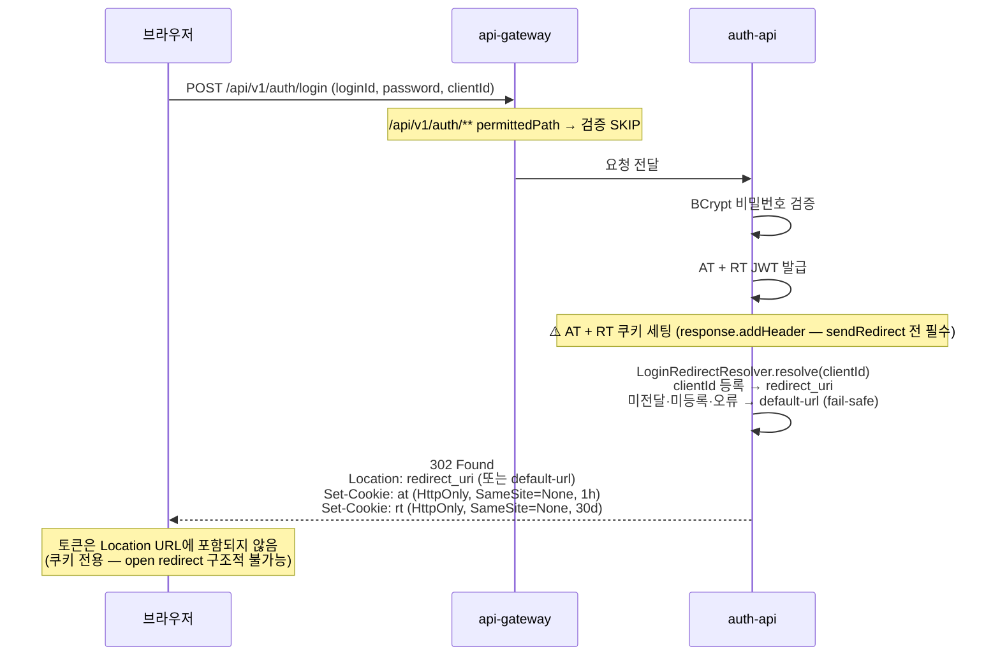
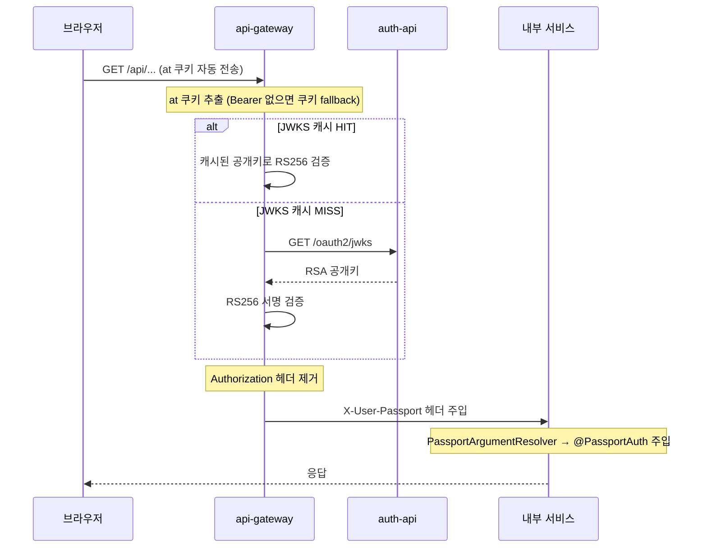
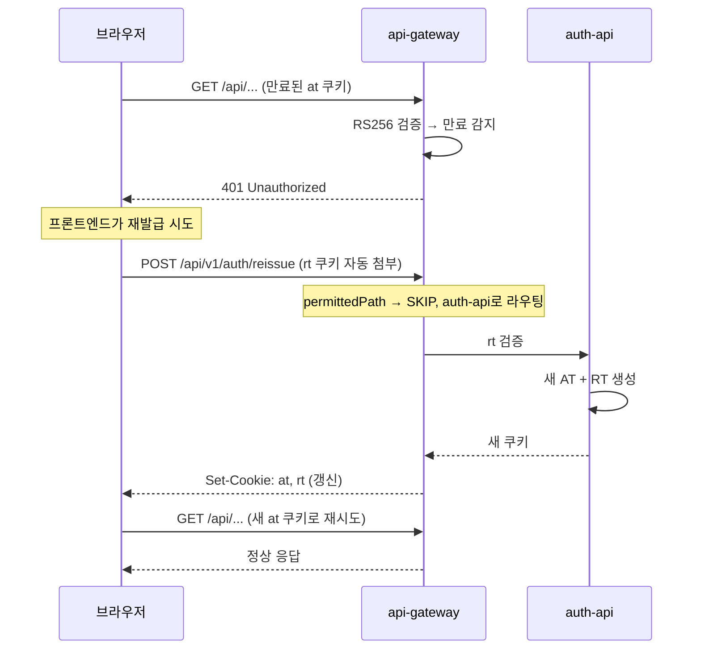
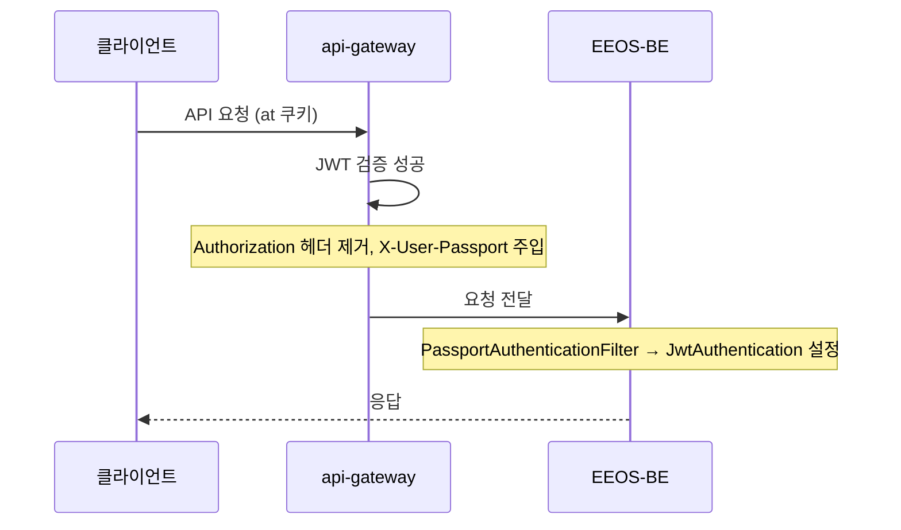
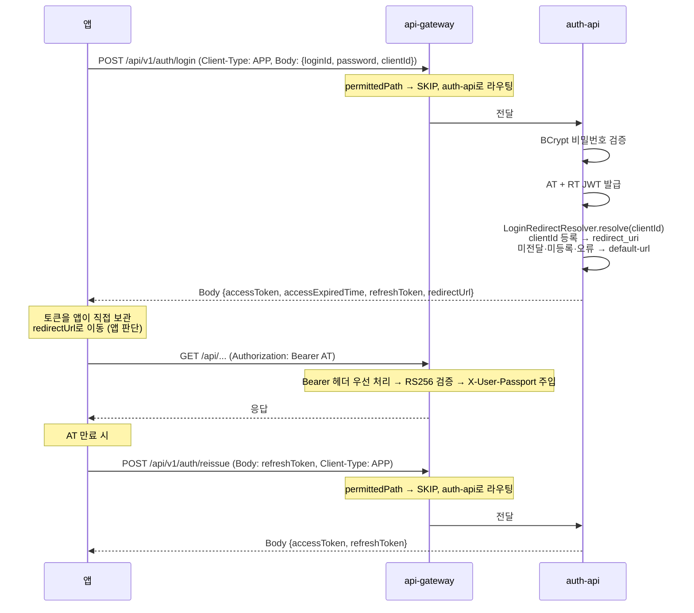
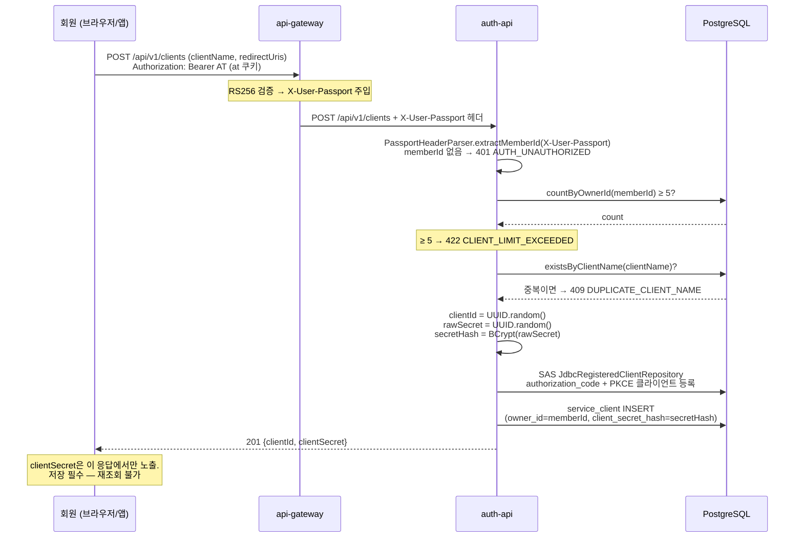
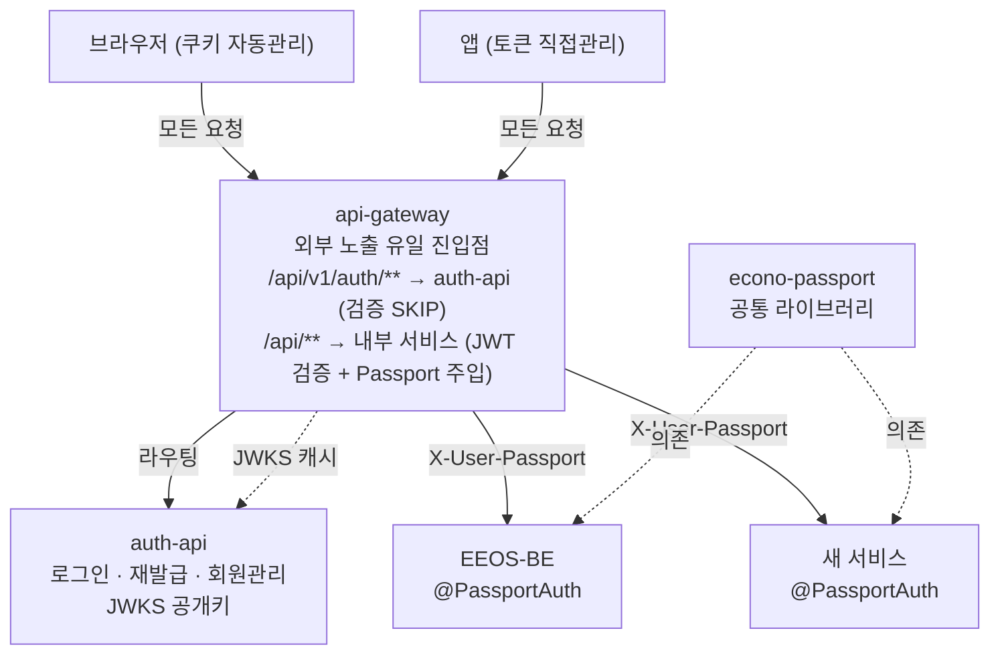

# 인증 흐름 시퀀스 다이어그램

## 1. WEB 로그인

```mermaid
sequenceDiagram
    participant C as 브라우저
    participant GW as api-gateway
    participant AUTH as auth-api

    C->>GW: POST /api/v1/auth/login (loginId, password, clientId)
    Note over GW: /api/v1/auth/** permittedPath → 검증 SKIP
    GW->>AUTH: 요청 전달
    AUTH->>AUTH: BCrypt 비밀번호 검증
    AUTH->>AUTH: AT + RT JWT 발급
    Note over AUTH: ⚠️ AT + RT 쿠키 세팅 (response.addHeader — sendRedirect 전 필수)
    AUTH->>AUTH: LoginRedirectResolver.resolve(clientId)<br/>clientId 등록 → redirect_uri<br/>미전달·미등록·오류 → default-url (fail-safe)
    AUTH-->>C: 302 Found<br/>Location: redirect_uri (또는 default-url)<br/>Set-Cookie: at (HttpOnly, SameSite=None, 1h)<br/>Set-Cookie: rt (HttpOnly, SameSite=None, 30d)
    Note over C: 토큰은 Location URL에 포함되지 않음<br/>(쿠키 전용 — open redirect 구조적 불가능)
```

## 2. API 호출 — SSO 자동 동작

```mermaid
sequenceDiagram
    participant C as 브라우저
    participant GW as api-gateway
    participant AUTH as auth-api
    participant SVC as 내부 서비스

    C->>GW: GET /api/... (at 쿠키 자동 전송)
    Note over GW: at 쿠키 추출 (Bearer 없으면 쿠키 fallback)

    alt JWKS 캐시 HIT
        GW->>GW: 캐시된 공개키로 RS256 검증
    else JWKS 캐시 MISS
        GW->>AUTH: GET /oauth2/jwks
        AUTH-->>GW: RSA 공개키
        GW->>GW: RS256 서명 검증
    end

    Note over GW: Authorization 헤더 제거
    GW->>SVC: X-User-Passport 헤더 주입
    Note over SVC: PassportArgumentResolver → @PassportAuth 주입
    SVC-->>C: 응답
```

## 3. AT 만료 시 자동 재발급

```mermaid
sequenceDiagram
    participant C as 브라우저
    participant GW as api-gateway
    participant AUTH as auth-api

    C->>GW: GET /api/... (만료된 at 쿠키)
    GW->>GW: RS256 검증 → 만료 감지
    GW-->>C: 401 Unauthorized

    Note over C: 프론트엔드가 재발급 시도
    C->>GW: POST /api/v1/auth/reissue (rt 쿠키 자동 첨부)
    Note over GW: permittedPath → SKIP, auth-api로 라우팅
    GW->>AUTH: rt 검증
    AUTH->>AUTH: 새 AT + RT 생성
    AUTH-->>GW: 새 쿠키
    GW-->>C: Set-Cookie: at, rt (갱신)

    C->>GW: GET /api/... (새 at 쿠키로 재시도)
    GW-->>C: 정상 응답
```

## 4. EEOS-BE 인증 흐름

```mermaid
sequenceDiagram
    participant C as 클라이언트
    participant GW as api-gateway
    participant EEOS as EEOS-BE

    C->>GW: API 요청 (at 쿠키)
    GW->>GW: JWT 검증 성공
    Note over GW: Authorization 헤더 제거, X-User-Passport 주입
    GW->>EEOS: 요청 전달
    Note over EEOS: PassportAuthenticationFilter → JwtAuthentication 설정
    EEOS-->>C: 응답
```

## 5. APP 클라이언트 (모바일)

```mermaid
sequenceDiagram
    participant APP as 앱
    participant GW as api-gateway
    participant AUTH as auth-api

    APP->>GW: POST /api/v1/auth/login (Client-Type: APP, Body: {loginId, password, clientId})
    Note over GW: permittedPath → SKIP, auth-api로 라우팅
    GW->>AUTH: 전달
    AUTH->>AUTH: BCrypt 비밀번호 검증
    AUTH->>AUTH: AT + RT JWT 발급
    AUTH->>AUTH: LoginRedirectResolver.resolve(clientId)<br/>clientId 등록 → redirect_uri<br/>미전달·미등록·오류 → default-url
    AUTH-->>APP: Body {accessToken, accessExpiredTime, refreshToken, redirectUrl}
    Note over APP: 토큰을 앱이 직접 보관<br/>redirectUrl로 이동 (앱 판단)

    APP->>GW: GET /api/... (Authorization: Bearer AT)
    Note over GW: Bearer 헤더 우선 처리 → RS256 검증 → X-User-Passport 주입
    GW-->>APP: 응답

    Note over APP: AT 만료 시
    APP->>GW: POST /api/v1/auth/reissue (Body: refreshToken, Client-Type: APP)
    Note over GW: permittedPath → SKIP, auth-api로 라우팅
    GW->>AUTH: 전달
    AUTH-->>APP: Body {accessToken, refreshToken}
```

## 6. SSO 클라이언트 셀프 등록

```mermaid
sequenceDiagram
    participant C as 회원 (브라우저/앱)
    participant GW as api-gateway
    participant AUTH as auth-api
    participant DB as PostgreSQL

    C->>GW: POST /api/v1/clients (clientName, redirectUris)<br/>Authorization: Bearer AT (at 쿠키)
    Note over GW: RS256 검증 → X-User-Passport 주입
    GW->>AUTH: POST /api/v1/clients + X-User-Passport 헤더
    AUTH->>AUTH: PassportHeaderParser.extractMemberId(X-User-Passport)<br/>memberId 없음 → 401 AUTH_UNAUTHORIZED
    AUTH->>DB: countByOwnerId(memberId) ≥ 5?
    DB-->>AUTH: count
    Note over AUTH: ≥ 5 → 422 CLIENT_LIMIT_EXCEEDED
    AUTH->>DB: existsByClientName(clientName)?
    DB-->>AUTH: 중복이면 → 409 DUPLICATE_CLIENT_NAME
    AUTH->>AUTH: clientId = UUID.random()<br/>rawSecret = UUID.random()<br/>secretHash = BCrypt(rawSecret)
    AUTH->>DB: SAS JdbcRegisteredClientRepository<br/>authorization_code + PKCE 클라이언트 등록
    AUTH->>DB: service_client INSERT<br/>(owner_id=memberId, client_secret_hash=secretHash)
    AUTH-->>C: 201 {clientId, clientSecret}
    Note over C: clientSecret은 이 응답에서만 노출.<br/>저장 필수 — 재조회 불가
```

## 7. 전체 아키텍처

```mermaid
graph TB
    WEB["브라우저 (쿠키 자동관리)"]
    APP["앱 (토큰 직접관리)"]

    GW["api-gateway\n외부 노출 유일 진입점\n/api/v1/auth/** → auth-api (검증 SKIP)\n/api/** → 내부 서비스 (JWT 검증 + Passport 주입)"]

    AUTH["auth-api\n로그인 · 재발급 · 회원관리\nJWKS 공개키"]
    EEOS["EEOS-BE\n@PassportAuth"]
    SVC["새 서비스\n@PassportAuth"]
    LIB["econo-passport\n공통 라이브러리"]

    WEB -->|모든 요청| GW
    APP -->|모든 요청| GW
    GW -->|라우팅| AUTH
    GW -->|X-User-Passport| EEOS
    GW -->|X-User-Passport| SVC
    GW -.->|JWKS 캐시| AUTH
    LIB -.->|의존| EEOS
    LIB -.->|의존| SVC
```
