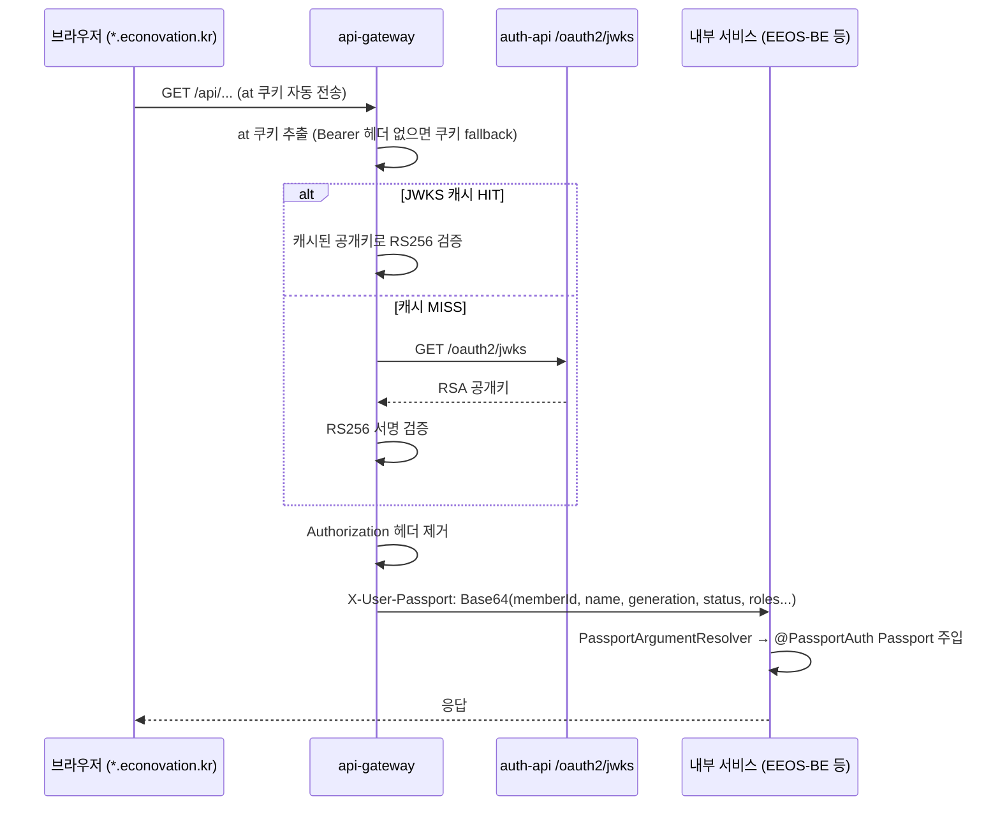
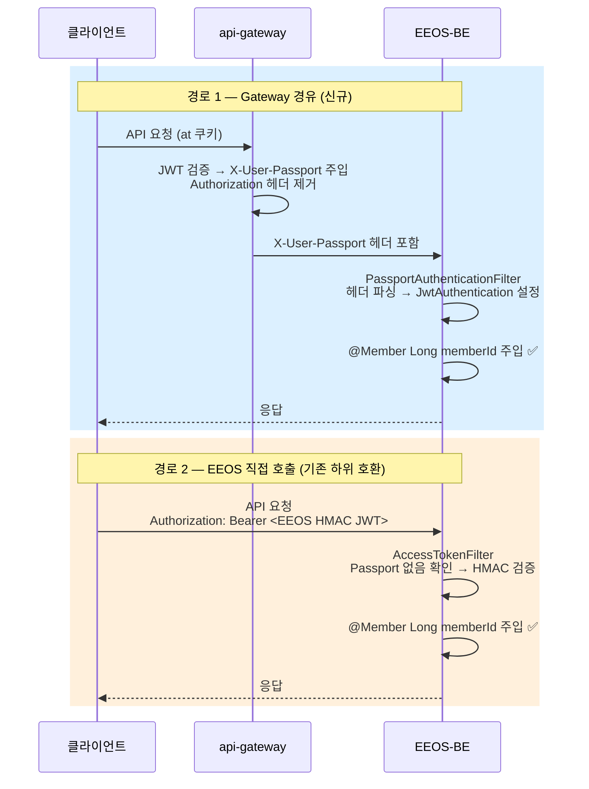
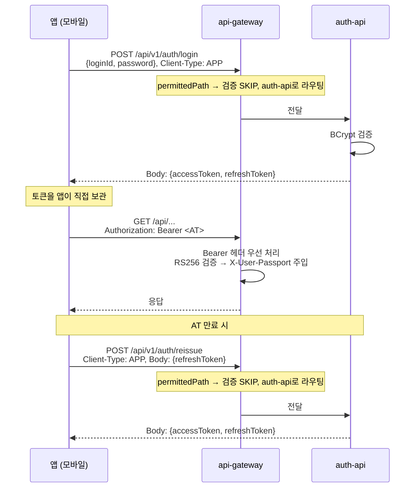

# 인증 흐름 시퀀스 다이어그램

## 1. WEB 로그인

```mermaid
sequenceDiagram
    participant C as 브라우저
    participant GW as api-gateway
    participant AUTH as auth-api

    C->>GW: POST /api/v1/auth/login<br/>{loginId, password}, Client-Type: WEB
    Note over GW: /api/v1/auth/** → permittedPath<br/>JWT 검증 SKIP, auth-api로 라우팅
    GW->>AUTH: 요청 전달
    AUTH->>AUTH: BCrypt 비밀번호 검증
    AUTH-->>GW: 200 OK + Set-Cookie
    GW-->>C: Set-Cookie: at=<JWT>; HttpOnly; Domain=.econovation.kr; Max-Age=3600<br/>Set-Cookie: rt=<JWT>; HttpOnly; Domain=.econovation.kr; Max-Age=2592000
```

## 2. API 호출 — SSO 자동 동작



## 3. AT 만료 시 자동 재발급

```mermaid
sequenceDiagram
    participant C as 브라우저
    participant GW as api-gateway
    participant AUTH as auth-api

    C->>GW: GET /api/... (만료된 at 쿠키)
    GW->>GW: RS256 검증 → 만료 감지
    GW-->>C: 401 Unauthorized

    Note over C: 프론트엔드가 재발급 시도
    C->>GW: POST /api/v1/auth/reissue<br/>Client-Type: WEB (rt 쿠키 자동 첨부)
    Note over GW: permittedPath → 검증 SKIP, auth-api로 라우팅
    GW->>AUTH: rt 쿠키 전달
    AUTH->>AUTH: RT 검증 → 새 AT + RT 생성
    AUTH-->>GW: 새 쿠키
    GW-->>C: Set-Cookie: at=<새JWT>; rt=<새JWT>

    C->>GW: GET /api/... (새 at 쿠키로 재시도)
    GW->>GW: RS256 검증 성공
    GW-->>C: 정상 응답
```

## 4. EEOS-BE 인증 — 두 경로 공존



## 5. APP 클라이언트 (모바일) 흐름



## 6. 전체 아키텍처

```mermaid
graph TB
    subgraph 클라이언트
        WEB[브라우저<br/>쿠키 자동관리]
        APP[앱<br/>토큰 직접관리]
    end

    subgraph 외부 노출 유일 진입점
        GW["api-gateway<br/>━━━━━━━━━━━━━━━━━━━━━━━<br/>/api/v1/auth/** → auth-api (검증 SKIP)<br/>/api/** → 내부 서비스 (JWT 검증 후 Passport 주입)"]
    end

    subgraph 내부망 직접 외부 노출 금지
        AUTH[auth-api<br/>로그인·재발급·회원관리<br/>JWKS 공개키]
        EEOS[EEOS-BE<br/>@PassportAuth]
        SVC[새 서비스<br/>@PassportAuth]
    end

    LIB[econo-passport<br/>공통 라이브러리]

    WEB -->|모든 요청| GW
    APP -->|모든 요청| GW
    GW -->|라우팅| AUTH
    GW -->|X-User-Passport 주입| EEOS
    GW -->|X-User-Passport 주입| SVC
    GW -.->|JWKS 캐시| AUTH
    LIB -.->|의존| EEOS
    LIB -.->|의존| SVC
```
